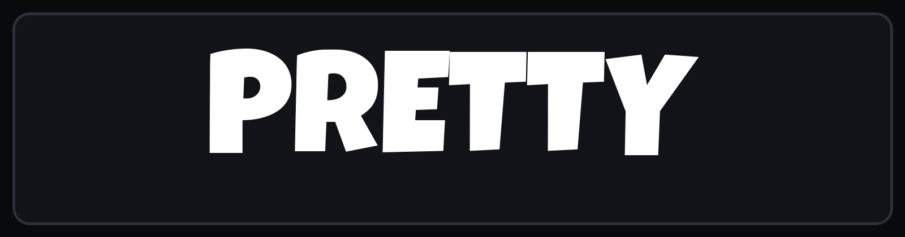

<h1 align="center">
  <a href="https://trypretty.dev">
    
  </a>
</h1>

<p align="center">
  <strong>A local-first studio for turning code, text, and images into polished technical visuals.</strong>
</p>

<p align="center">
  <a href="https://trypretty.dev"><strong>Open Pretty</strong></a>
  ·
  <a href="https://github.com/lucianmocan/scripture/issues">Report a bug or request a feature</a>
  ·
  <a href="./LICENSE">GPL-3.0</a>
</p>

## Make the explanation part of the code

Pretty is a desktop design tool for code walkthroughs, before-and-after comparisons, tutorials, release notes, and any other place where a plain screenshot falls short.

Start from a template or an empty document, arrange blocks on a free-form canvas, add context with text and images, then export the finished pages. The editor stays compact and out of the way while you work.

## What you can do

- **Build with real blocks.** Mix syntax-highlighted code, rich text, images, and nested frames instead of flattening everything into a screenshot.
- **Lay things out your way.** Use flex layouts for structured compositions or switch to free-form positioning without losing the visual arrangement you already made.
- **Present code clearly.** Choose from Shiki's language and theme library, tune typography and spacing, add line numbers or window chrome, and set a background per code block.
- **Explain the important lines.** Add line highlights, diffs, trims, and draggable callouts directly on the composition.
- **Work across pages.** Create, reorder, and remove pages from the Layers panel. Templates give common layouts a useful head start.
- **Stay precise on the canvas.** Drag, resize, zoom, pan, marquee-select, nudge, align, distribute, and use smart guides for edges, centers, and equal gaps.
- **Find and edit faster.** Search and replace document text from the Layers panel, even when a match crosses formatting boundaries.
- **Export the result.** Render the current page as PNG or the full document as a multi-page PDF, with content-sized, A4, Letter, and custom PDF page sizes.
- **Pick up where you stopped.** Documents autosave locally, and the dashboard shows real previews for pinned work.

## A quick tour

1. Open [Pretty](https://trypretty.dev) and create a blank document or choose a template.
2. Add code, text, images, or frames from the canvas controls.
3. Use **Layers** to organize pages and blocks, and **Properties** to shape the selected item.
4. Arrange the composition in flex or free-form mode.
5. Export it from the inspector when it is ready to share.

Pretty is currently designed for desktop workspaces only.

### Your work stays in your browser

Documents are stored in IndexedDB and saved automatically in the browser where you created them. There is no account, cloud sync, or live collaboration yet.

That also means browser storage matters: clearing site data removes the documents stored for that origin. Work created on `localhost` is separate from work created on the hosted site.

## Canvas shortcuts

Shortcuts use <kbd>⌘</kbd> on macOS and <kbd>Ctrl</kbd> on Windows and Linux.

| Action | Shortcut |
| --- | --- |
| Undo / redo | <kbd>⌘ Z</kbd> / <kbd>⌘ ⇧ Z</kbd> |
| Duplicate selection | <kbd>⌘ D</kbd> |
| Delete selection | <kbd>Delete</kbd> or <kbd>Backspace</kbd> |
| Nudge | Arrow keys |
| Nudge by 10 px | <kbd>Shift</kbd> + arrow key |
| Select sibling layers | <kbd>⌘ A</kbd> |
| Enter or leave editing | <kbd>Enter</kbd> / <kbd>Escape</kbd> |
| Pan | Hold <kbd>Space</kbd> and drag, or drag with the middle mouse button |
| Zoom in / out / reset | <kbd>⌘ +</kbd> / <kbd>⌘ -</kbd> / <kbd>⌘ 0</kbd> |

## For developers

Pretty is a Next.js App Router application written in TypeScript. Its editor combines:

- React 19 and Next.js 16
- Tiptap and ProseMirror for editable text and code content
- Yjs with IndexedDB persistence for local-first documents
- Shiki for syntax highlighting
- Tailwind CSS and Radix-based UI components
- Browser-native SVG/canvas capture plus pdf-lib for hosted-safe exports
- MuPDF.js for client-side PDF page import
- IMG.LY background-removal-js for on-device image background removal

### Run it locally

You will need Node.js 20.9 or newer.

```bash
git clone https://github.com/lucianmocan/scripture.git
cd scripture
npm install
npm run dev
```

Then open [http://localhost:3000](http://localhost:3000).

### Useful commands

| Command | Purpose |
| --- | --- |
| `npm run dev` | Start the local development server |
| `npm test` | Run the unit test suite |
| `npm run test:e2e` | Run Playwright interaction tests |
| `npm run lint` | Check the code with ESLint |
| `npm run build` | Create a production build |
| `npm start` | Run the production build |

If Playwright does not have a browser installed yet, run `npx playwright install chromium` before the browser suite.

## Contributing

Bug reports, focused fixes, and thoughtful feature proposals are welcome.

1. [Open an issue](https://github.com/lucianmocan/scripture/issues) for a bug or larger idea so the problem is clear before implementation begins.
2. Fork the repository and create a short-lived branch.
3. Keep the change focused and add coverage for behavior that could regress.
4. Run the relevant tests, lint, and production build.
5. Open a pull request that explains the user-facing change and any tradeoffs.

When working in the editor, please preserve the local-first data model and the compact desktop visual language. New dependencies should earn their place.

## License

Pretty's own source code is free software licensed under the [GNU General Public License, version 3](./LICENSE). You may use, study, modify, and redistribute it under the terms of that license.

PDF page import uses the unmodified MuPDF.js package under the [GNU Affero General Public License, version 3 or later](./LICENSES/AGPL-3.0.txt). MuPDF remains under its own license; see [Third-party notices](./THIRD_PARTY_NOTICES.md) for attribution, upstream source, and corresponding-source information.

Client-side background removal uses the unmodified IMG.LY `@imgly/background-removal` package under the GNU Affero General Public License, version 3. It remains under its own license and is also documented in the [third-party notices](./THIRD_PARTY_NOTICES.md).

MuPDF only reads selected source PDFs and converts their pages to SVG images. Pretty's exported PDFs are created separately by `pdf-lib`, so MuPDF is not listed as their producer.

<p align="center">
  The Pretty wordmark is set in <a href="https://fonts.google.com/specimen/Luckiest+Guy">Luckiest Guy</a>.
</p>
